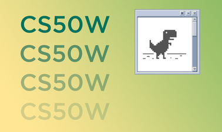

# CS50Web
This repository contains my attempts at projects from [CS50’s Web Programming with Python and JavaScript](https://cs50.harvard.edu/web/2020/) course of 2020.

## Projects
0. Google Search Recreation
1. Wikipedia-like Encyclopedia
2. eBay-like e-commerce auction site
3. Front-end for an email client that makes API calls to send and receive emails
4. Twitter-like social network website