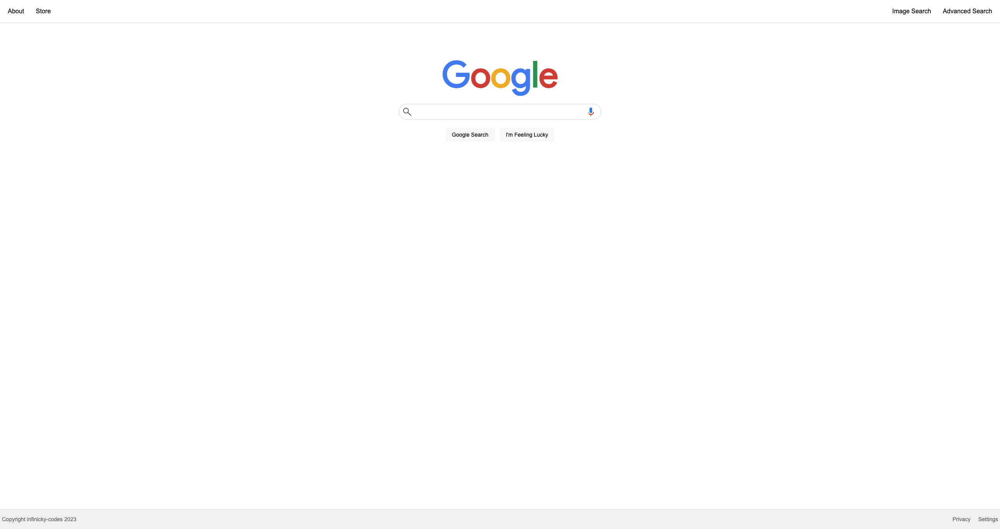

# Project 0: Search

A recreation of Google's 2020 front-end for Google Search, Google Image Search, and Google Advanced Search.

## Features

- On the Google Search page, the user is able to type in a query, click “Google Search”, after wich they are taken to the Google search results page for that query.
  - The user can click an “I’m Feeling Lucky” button. Consistent with Google’s own behavior, clicking this button will take users directly to the first Google search result for the query, bypassing the normal results page.
- On the Google Image Search page, the user can likewise type in a query, click a search button, but will be taken to the Google Image search results page.
- On the Google Advanced Search page, the user can provide input for the following four fields (taken from Google’s own advanced search options)
  - Find pages with… “all these words:”
  - Find pages with… “this exact word or phrase:”
  - Find pages with… “any of these words:”
  - Find pages with… “none of these words:”

  When the “Advanced Search” button is clicked, the user is taken to the search results page for their given query.