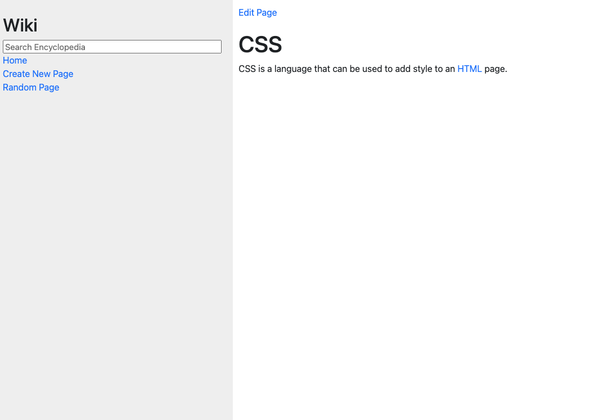

# Project 1: Wiki

A Wikipedia-like online encyclopedia for Programming languages / Frameworks. This project focusses mainly on the back-end using Django. Each encyclopedia entry is saved as a Markdown file.

## Features

- Entry Page: Visiting /wiki/TITLE, where TITLE is the title of an encyclopedia entry, renders a page that displays the contents of that encyclopedia entry.
  - Markdown to HTML Conversion: On each entry’s page, any Markdown content in the entry file is converted to HTML before being displayed to the user. This is done using the python-markdown2 package.
  - If an entry is requested that does not exist, the user will be presented with an error page indicating that their requested page was not found.
  - If the entry does exist, the user will be presented with a page that displays the content of the entry.  The title of the page should include the name of the entry.
- Index Page: A user can click on any entry name in the list to be taken directly to that entry page.
- Search: The user can type a query into the search box in the sidebar to search for an encyclopedia entry.
  - If the query matches the name of an encyclopedia entry, the user will be redirected to that entry’s page.
  - If the query does not match the name of an encyclopedia entry, the user is instead taken to a search results page that displays a list of all encyclopedia entries that have the query as a substring. For example, if the search query were ytho, then Python will appear in the search results.
  - Clicking on any of the entry names on the search results page will take the user to that entry’s page.
- New Page: Clicking “Create New Page” in the sidebar takes the user to a page where they can create a new encyclopedia entry, where they can enter a title and Markdown content for the page.
  - Users can click a button to save their new page.
  - When the page is saved, if an encyclopedia entry already exists with the provided title, the user will be presented with an error message. Otherwise, the encyclopedia entry is saved to disk, and the user is taken to the new entry’s page.
- Edit Page: On each entry page, the user can click a link to be taken to a page where the user can edit that entry’s Markdown content in a textarea (pre-populated with the existing Markdown content of the page).
  - The user is able to click a button to save the changes made to the entry.
  - Once the entry is saved, the user is redirected back to that entry’s page.
- Random Page: Clicking “Random Page” in the sidebar takes the user to a random encyclopedia entry.